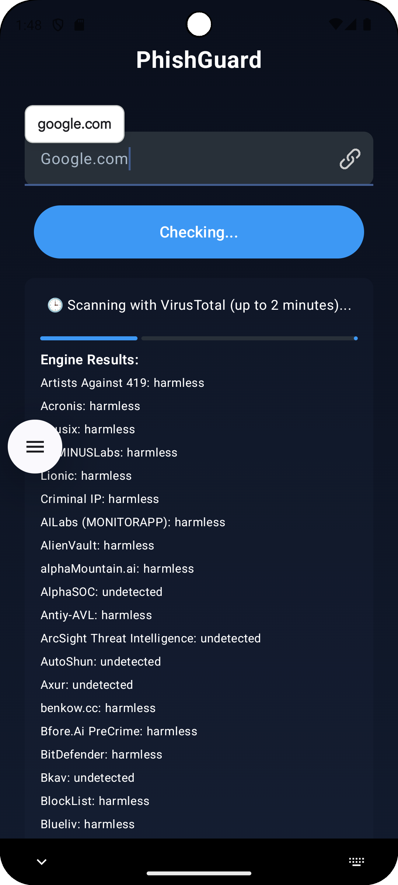

# 🚀 PhishingURLDetector

PhishingURLDetector is a modern Android app built with **Kotlin** and **Jetpack Compose** that helps protect users from phishing or malicious websites. It leverages **Google Safe Browsing** and **VirusTotal** APIs to analyze any URL for suspicious or harmful behavior, providing quick and reliable results.

---

## ✨ Features

✅ Scan URLs in real-time for phishing, malware, or suspicious content  
✅ Uses dual APIs (Google Safe Browsing + VirusTotal) for maximum security  
✅ Progress indicators for user-friendly scanning status  
✅ Clean, modern Compose-based UI  
✅ MVVM architecture with coroutines and Retrofit  
✅ Secure API key management with `local.properties`  
✅ Open source and beginner-friendly

---

## 🛠️ Tech Stack

- **Kotlin**  
- **Jetpack Compose**  
- **Retrofit**  
- **Coroutines**  
- **MVVM architecture**

---

## 📸 Screenshots

| Home Screen | Scan in Progress | Results |
|-------------|------------------|---------|
|  |  |  |

